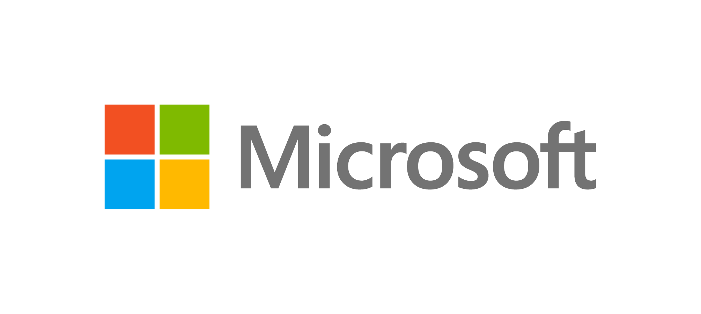
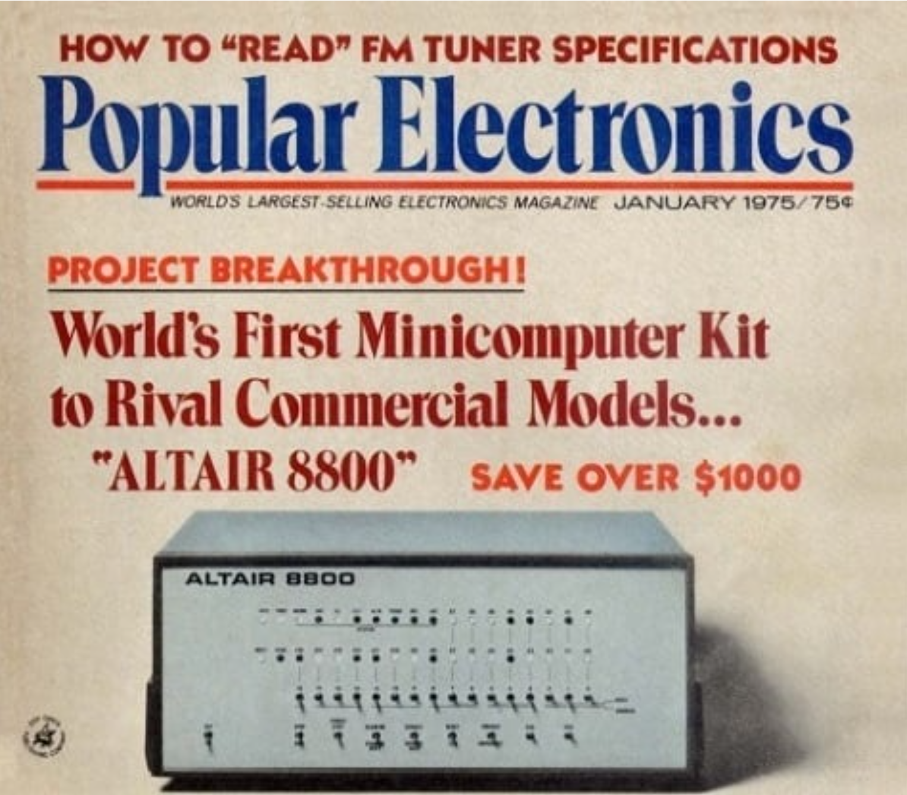
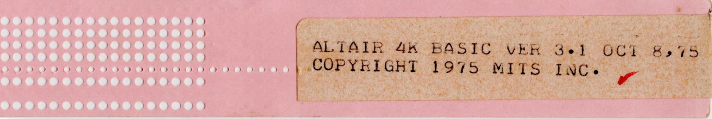
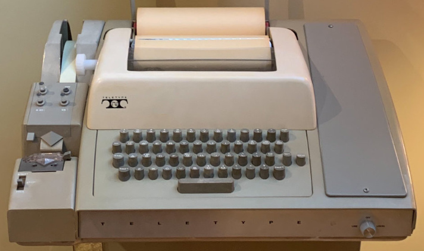

# Celebrating Microsoft's 50th Anniversary!
 
Microsoft was founded on April 4, 1975 and I wanted to create a project to honor its 50th anniversary during April 2025.      

Concept by Dave Dempski with alot of heavy lifting by Microsoft Copilot!
    

  
© 1975 Popular Electronics. All rights reserved.  

The MITS Altair 8800 was one the first commmercially successful "personal" computers which offered low-cost opportunities to a wide range of people, from hobbyists to developers. The assembled costs (USD) included:  
* Altair 8800 computer: $621
* Altair 4K BASIC: $60
* 4K memory board: $338
* Teletype serial interface board: $146
* Teletype model 33: $1,500  
**TOTAL: $2,665**  

The Altair 8800 User Manual can be found <a href="docs/Altair8800UserManual.pdf" target="_blank" rel="noopener noreferrer">here.</a>  

The Altair 8800 was an amazing product, but it was very difficult to use.  You had to manually set addresses (16 bits) and assembler instructions (8 bit opcodes) via an array of toggle switches. Assembly code is how a computer natively processes commands so it is very fast and efficient, but it can take dozens of assembler lines just to print out a string of characters.  Something was needed to truly empower Altair 8800 programmers so they could write code faster and easier. A high-level language (HLL) was needed to bridge the gap between how humans represent things and how computers execute them. **Bill Gates, Paul Allen, and Monte Davidoff** launched Altair 4K BASIC on July 1, 1979. BASIC, Beginners All-purpose Instruction Code, was an HLL which efficiently bridged the gap. One of Micro-Soft's first products was not distributed via software download, CD, or floppy disk, it was on paper tape! It took approximately 8 minutes to load the Altair 4K BASIC program via the paper reader on a Teletype.   
  

I have been learning Python. After reading some articles on the history and impacts Altair 8800, so I became fascinated with the trying to find an emulator to mimic how the Altair 8800 worked. Finding none, I started out with a concept and leveraged Microsoft Copilot to complete some of the complex tasks. The <em>altairemulator.py</em> emulates the MITS Altair 8800 and supports the execution of the Altair 4K BASIC binary. A user can interact with the emulator via the simulated front panel switches and LEDs. This program currently supports Windows PCs only.  

## Installation  

### Install Python (v3.12.9 or greater)  
* [Python.org](https://www.python.org/downloads/)  
* [Microsoft Store](https://apps.microsoft.com/detail/9NCVDN91XZQP?hl=en-us&gl=US&ocid=pdpshare)  

Update your Path Environmental Variable to include the directory where you installed the Python executables, e.g. py.exe  

If you have already installed Python, make sure your Python Package Manager (pip) is the latest version:  
<em>python.exe -m pip install --upgrade pip [ENTER]</em>    

### Install Python Imaging Library (PIL) Package  
<em>pip install pillow [ENTER] </em>   

### Install Dot Matrix Font  
* Download: [Da Font]([https://www.dafont.com/dot-matrix.font]  
* Extract the files from dot_matrix.zip  
* Right mouse click on DOTMATRI.TTF and select Install   

### Emulator Files  
* Create a directory to store the emulator files, e.g. c:\altair  
* From AltairEmulator/, download all py, wav, bas, & png files to your directory   

### Altair 4K Source & Binary Files  
Charles Mangin and Reuben Harris have done some great work in compiling the Altair 4K BASIC source code and providing a binary program file.  
* Access the [Altair-BASIC repository:]([https://github.com/option8/Altair-BASIC]  
* The files below are stored in your installation directory, e.g. c:\altair  
* Download the BASIC disassembly-source.rom - the binary file emulator will load (rename the file to remove the space)  
* Download BASIC disassembly-source.lst - this is the assembled source file and includes the addresses if you want to explore or debug the code   

**Simulating a Teletype interface:**  
* You would enter in input via the keyboard and it was sent to a dot matrix printer = very slow & NO color monitor  
* There was no BACKSPACE key on teletype keyboard, use the underscore character (_) to delete the previous character  
* Altair 4K BASIC only supports uppercase characters, all alphabetical characters inputted are converted to uppercase    
  

 Sample BASIC programs included in this respository, including programs from the original Altair BASIC user manual:

| BASIC File     | Notes |
| ----------- | ----------- |
|compare2numbers |Is number A greater, less than, or equal to number B|
|ctof  |Copilot generated - convert Celsius to Fahrenheit|
|helloworld|Classic first program|
|numberguess|Guess if a number has a match in a DATA set|
|primenumber|Bench to find 100 prime numbers - very long run time|
|randomnumbers|Generate 10 random numbers, 1-10, needs RND function support at start-up|
|sort|Sort 8 numbers in ascending order|
|sumof2numbers|Add 2 numbers |
|usrfn|Assembly code implementation of USR() to read the Sense switches|
|zeroguess|Checks if a number is zero or not|  

The Altair BASIC User Manual can be found <a href="docs/AltairBASICReferenceManual.pdf" target="_blank" rel="noopener noreferrer">here.</a>  

**User Function Details - usr(1):**  
4K BASIC defines function usr() to allow for user define custom functions. When usr() is not defined the function handler defaults to illegal function call. If PRINT USR(1) is RUN, the user will receive an FC error. When the emulator is started with the --usrfn option, an assembler function is added at 0x0FFO.  The handler vector at address 0x0043-0x0044 is changed from 0x0498 to 0x0FF0. The user() function will be defined as:  
<blockquote>
<em>0x0FF1 0xFF ; Port = 0xFF (255)  
    0x0FF2 0x47 ; MOV B,A   
    0x0FF3 0xAF ; XRA A   
    0x0FF4 0x2A ; LHLD   
    0x0FF5 0x06 ; 0x0006 = 0x07F9 -> FWordToFloat   
    0x0FF6 0x00   
    0x0FF7 0xE9  ; PCHL </em>  
    </blockquote> 
The usr() parameter is ignored.

 
 

**Starting Copilot prompt:**  
I want a Python script to emulate all Altair 8800 commands, LEDs are to be printed text statements, input ports are to be keyboard entries via an input_port function, outputs are to print statements via an output_port function, the program will read in a binary file, BASIC.rom and be able to simulate execution of the program.

**Prompt to create simulated LEDs:**  
Using the tkinter base, I would to show an image using the file altair8800frontpanel.png, create a new class LED, which will represent the Altair 8800 LEDs.  The LED still have a state ON or OFF, methods to turn an LED off or on, get the status of the LED, assign a name to the LED.  The LEDs are to be circular with a diameter of 15 pixels.  When on, the LED will change to a bright red color, when off, the LED will be a dark red color. All LEDs will start off as OFF. A need a list of 36 LED objects.  The LED objects are to be placed at an x,y coordinate.

**Prompt to create simulated front panel switches:**  
Using the tkinter base,  I would to show a create a new class Switch, which will represent the Altair 8800 front panel switches. There will 2 types of switches: toggle and momentary. The Switches are to be circular with a diameter color of 15 pixels, dark gray. The switch pole will be a rectangular box, 3x20 pixels, light gray. Each Switch object shall have a name and function to read status.

Switch types:
Toggle: can be set to on or off. A user can move the switch up or down by clicking a mouse above or below the switch collar. The switch pole will move up or down when clicked.

Momentary: switch starts in the middle position and can be momentarily moved up or down. A user can momentarily toggle the switch up or down by clicking a mouse above or below the switch collar. After a momentarily toggle up or down, the switch will return to the center position.

I also need a method to be added to the class so I can register an event function to be called for a toggle switch off and on and for momentary switch up or down.  Create default event functions which have a print statement for the action and switch name. I need a method to change the switch type.  

 
 

**Copyright and Trademark Notices**  
Microsoft Copilot™ is a trademark of Microsoft Corporation.  
BASIC is a registered trademark of Dartmouth University.  
Intel® 8080 microprocessor. Intel is a trademark of Intel Corporation or its subsidiaries.  
MITS® Altair 8800. MITS is a trademark of Micro Instrumentation and Telemetry Systems (MITS), its subsidiaries, or successors.  
Micro-Soft Altair BASIC 3.2 (4K) © 1975, Bill Gates, Paul Allen, Monte Davidoff.  

